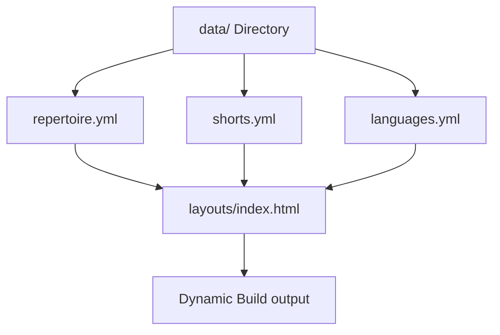

# Refined Requirements: Jekyll to Hugo Migration & Website Revamp (Dynamic & Crowdpleaser Integrated)

This document provides the complete, expanded specification for migrating the **Roxx Mixx Duo** website from Jekyll to Hugo and executing a visual and structural revamp. It integrates critical content from their professional [Crowdpleaser Profile](https://www.crowdpleaser.com.au/Roxx-Mixx-Duo) and outlines a dynamic, data-driven architecture.

---

## 1. Project Overview & Objectives

*   **Core Identity:** Roxx Mixx Duo, consisting of veteran musicians **Raul Roxas** and **Stifany Chung** (also known as Lee, professional MC/host), is a high-demand, premier cover band based in Melbourne.
*   **Decades of Expertise:** With over **20 combined years of live performance experience** across Australia, India, Malaysia, and the Philippines, they bring an exceptional level of professionalism and versatility to every event.
*   **Fully Self-Contained Gear:** The duo provides a stress-free experience by supplying all of their own professional equipment, including a high-end PA system, mixing desk, stage lighting, and wireless microphones.
*   **Dynamic Data-Driven Structure:** To handle their massive **600+ song repertoire** and a growing archive of performances, the website will transition to a **dynamic static site (Hugo + Data Files)**. This allows the band to easily update songs, videos, and settings in single YAML/JSON files, which automatically rebuilds and refreshes the website.

---

## 2. Technical Migration & Dynamic Data Architecture

The revamp replaces the rigid, static Jekyll HTML structure with Hugo’s dynamic template parsing driven by dedicated **data collections**.



### 2.1 Hugo Data Collections (`data/` directory)
Instead of hardcoding song listings and videos in HTML:
1.  **`data/repertoire.yml`**: A structured database of their 600+ song backlog. Each entry will record:
    ```yaml
    - title: "Despacito"
      artist: "Luis Fonsi"
      genre: "Latin / Bachata"
      language: "Spanish"
    - title: "Tujhe Dekha To"
      artist: "Kumar Sanu"
      genre: "Bollywood"
      language: "Hindi"
    ```
2.  **`data/shorts.yml`**: A list of YouTube Shorts and videos highlighting different language acts:
    ```yaml
    - id: "youtube_short_id"
      title: "Chandelier Cover in Tagalog"
      language: "Tagalog"
      thumbnail: "images/shorts/tagalog_short.jpg"
    ```
3.  **`data/languages.yml`**: Details of the **18 languages** performed by Stifany, mapping flags, language names, and hit songs.

### 2.2 Template & Directory Mapping

| Source (Jekyll) | Destination (Hugo) | Action / Dynamic Purpose |
| :--- | :--- | :--- |
| `_config.yml` | `hugo.toml` | Global parameters (social links, contact info, SEO metadata). |
| `_layouts/` | `layouts/_default/` | Base layouts (`baseof.html`, `single.html`) with flexible blocks. |
| `_includes/` | `layouts/partials/` | Modular UI blocks (header, footer, navigation). |
| `_sass/` & `css/` | `assets/scss/` | Modern SCSS styling compiled and compressed via Hugo Pipes. |
| `images/` | `assets/images/` | Band photos. Optimised and resized dynamically using Hugo Image Processing. |
| *New Dynamic Data* | `data/` | YAML files representing songs, shorts, and language pills. |
| `index.html` | `layouts/index.html` | The homepage layout which loops through `data/` structures to build the HTML components. |

---

## 3. UI/UX Design System (Rich Band Aesthetics)

The revamp moves away from basic templates to project a high-end, premium concert-stage atmosphere.

### 3.1 Color Palette (Midnight Stage Theme)
*   **Obsidian Dark (90%):** A primary background of deep charcoal-obsidian (`#0a090c`) fading into midnight violet (`#120e1a`) to represent a dark stage.
*   **Vibrant Violet (Primary Accent):** Electric Neon Purple (`#8a2be2` / `#a34cff`) used for glowing text, button outlines, and active state indicators.
*   **Sunset Gold (Secondary Accent):** Premium gold/yellow gradient (`#ffb703` to `#ffa600`) to highlight primary CTAs, reviews, and badges (e.g. "18+ Languages").
*   **Neon Pink (Visual Highlights):** Hot Magenta (`#ff007f`) for fine borders, hover glows, and visual interest.
*   **Typography Contrast:** Pure white (`#ffffff`) for main headings; soft silver (`#d1d5db`) for readable body copy.

### 3.2 Premium Typography
*   **Headers:** `Outfit` (Google Fonts) – a geometric, high-impact, modern sans-serif that looks spectacular in bold caps.
*   **Body Copy:** `Plus Jakarta Sans` or `Inter` – optimized for spacing and high legibility.

### 3.3 Micro-Animations & Glow Effects
*   **Interactive Cards:** Cards scale (`transform: scale(1.02)`) and light up with a drop shadow glow on hover.
*   **Smooth Marquee:** The language carousel moves with a hardware-accelerated CSS marquee that pauses gracefully on hover.

---

## 4. Key Page Sections & Feature Specifications

### 4.1 Sticky Navigation Header (The Booking Bridge)
*   **Visuals:** Ultra-thin, frosted glass (`backdrop-filter: blur(16px)` with `background: rgba(10, 9, 12, 0.7)`).
*   **Brand Identifier:** Sleek typography representing "Roxx Mixx Duo".
*   **CTAs:** Navigation links + a prominent **Book Us Now** button (glowing Sunset Gold gradient) which routes directly to their [Facebook Page](https://facebook.com/roxx.mixx.5) for instant booking and quoting.

### 4.2 Immersive Hero Banner (Splash Photo Profile)
*   **Band Profile Image:** A stunning, high-definition photograph of Raul and Stifany performing.
*   **Overlays:** Dark gradients blending down to pure obsidian background with glowing text overlays:
    *   `Global Sounds, Melbourne Heart` (Large glowing header).
    *   `Melbourne's Premier Multi-Lingual Cover Band | 20+ Years Experience`.
*   **CTA Button:** "View Repertoire" scroll link + "Book Roxx Mixx Duo" primary link.

### 4.3 Interactive Multilingual Pill Showcase (18 Languages)
*   **The USP:** Stifany performs in **18 distinct languages**.
*   **Languages Represented:** *English, Chinese (Mandarin & Cantonese), Tagalog (Filipino), Hindi, Spanish, Italian, Japanese, Korean, Sri Lankan (Sinhala), Malaysian, Indonesian, Turkish, and more.*
*   **Interactive Component:**
    *   An auto-scrolling loop (marquee) of glowing badges.
    *   Clicking a badge highlights a popular cover song in that language from their repertoire!

### 4.4 Dynamic & Filterable Repertoire Directory
*   **The Problem:** Displaying 600+ songs in a plain HTML list is overwhelming.
*   **The Dynamic Solution:**
    *   A clean, interactive search and filter module driven by `data/repertoire.yml`.
    *   **Filter Categories:** `All`, `Rock`, `Pop`, `Jazz`, `R&B`, `Country`, `Bachata / Latin`.
    *   **Live Search Bar:** Instant client-side search (powered by lightweight vanilla JS filtering) letting event coordinators search by Song Title or Artist name.

### 4.5 Responsive YouTube Shorts Performance Grid
*   **Objective:** Show their live energy and language versatility using vertical YouTube Shorts.
*   **Visuals:** Phone-framed mockups with high-quality performance thumbnails and language overlays.
*   **Modal Player:** Clicking a video triggers a responsive overlay modal (`<iframe>`) to stream the YouTube Short immediately without taking the user away from the site.
*   **Dynamic Data:** Rendered directly by looping over `data/shorts.yml` entries.

### 4.6 Stress-Free Event Service & Gear Section
*   **The Crowdpleaser Value:** Highlighting that the duo is a full-service, stress-free package.
*   **Service Highlights:**
    *   **Full Production Included:** High-end PA system, mixing desk, and professional stage lighting supplied at no extra cost.
    *   **Wireless Microphones:** Available for wedding speeches and corporate MC duties (Stifany is a highly rated professional MC).
    *   **Event Tailoring:** Customizable setlists from timeless classics to modern TikTok hits, tailored for Weddings, Corporate, Birthday Parties, and Festivals.

### 4.7 Bottom Booking CTA & Footer
*   **Booking Hub Section:** Highly stylized banner at the bottom of the page.
*   **Booking Outlets:**
    *   Primary Gold CTA: **Book Us Now** linking to their [Facebook Page](https://facebook.com/roxx.mixx.5).
    *   Alternative Contact: Direct phone dial to Marie (`0423 761 105`) and email (`roxxmixx.duo@gmail.com`).
*   **Footer Links:** Minimalist layout with vectors for Facebook, Bandcamp, YouTube, and Email.
*   **Copyright:** Auto-updating year block (e.g., `© 2017-2026 Roxx Mixx Duo. All rights reserved.`).

---

## 5. Non-Functional & Optimization Requirements

*   **SEO Schema (JSON-LD):** Embed full `MusicGroup` schema containing details of members (Raul Roxas, Stifany Chung), languages, genres, and active social/booking profiles.
*   **Lazy Loading:** Apply standard `loading="lazy"` on all image assets, and defer YouTube iframe loading until clicked to maximize performance and achieve a perfect Google PageSpeed score.
*   **Tailored Responsive Breakpoints:** Custom CSS design built mobile-first, ensuring fluid display on standard smartphones, tablets, and large displays.

---

## 6. Migration and QA Verification Plan

1.  **Hugo compilation:** Local verification (`hugo --gc --minify`) to ensure zero errors and fully optimized build assets.
2.  **Data Loop Check:** Confirm all songs from `data/repertoire.yml` and videos from `data/shorts.yml` render dynamically on the index page.
3.  **Search & Filter QA:** Test that the client-side JavaScript filters songs and performs instant searching instantly on mobile and desktop.
4.  **CTA Validation:** Verify all booking paths successfully direct users to their Facebook page and trigger email/phone actions correctly.
